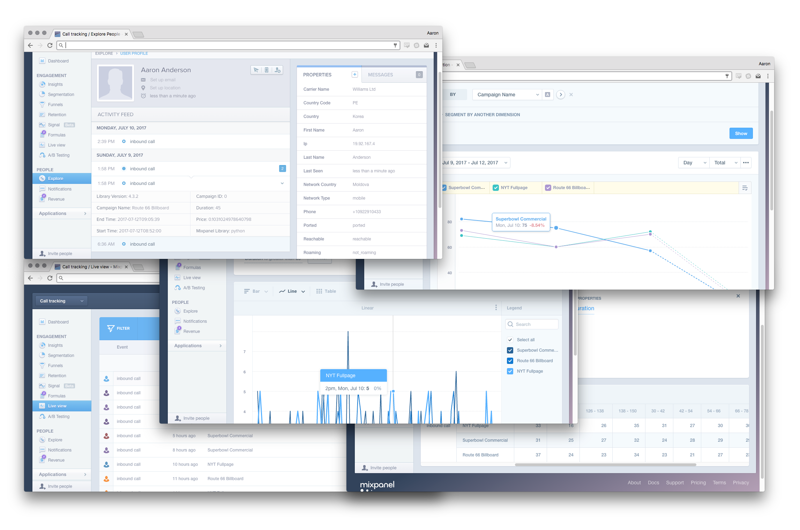

# Inbound call tracking

Track your inbound voice campaigns using [Nexmo virtual numbers](https://nexmo.com),
[Mixpanel](https://mixpanel.com), and Django. Keep an eye on the
[Nexmo blog](https://nexmo.com/blog) for the complete write up and tutorial which is
coming soon. In the meantime you can read more about our Voice API on our
[developer site](https://developer.nexmo.com/).

## Quick start

You'll need a [Nexmo account](https://nexmo.com) and a [Mixpanel account](https://mixpanel.com)
then create the following environment variables with the relevant API keys/secrets.

    export MIXPANEL_TOKEN="YOUR MIXPANEL PROJECT TOKEN"
    export NEXMO_API_KEY="YOUR NEXMO API KEY"
    export NEXMO_API_SECRET="YOUR NEXMO API SECRET"

It's a standard Django application, you manage the different campaigns via the Django admin so
create a superuser before starting the server:

    python manage.py migrate
    python manage.py createsuperuser
    python manage.py runserver

You'll need to make your Django server publicly accessible so it can be reached by the Nexmo APIs.
[I advise using ngrok](https://www.nexmo.com/blog/2017/07/04/local-development-nexmo-ngrok-tunnel-dr/)

Create your Nexmo application. The event url should POST to `<YOUR URL>/events/` and the answer url should GET from `<YOUR URL>/answer/`. Now log into your Django admin server at `<YOUR URL>/admin` using your super user credentials. Create a new Campaign and enter your Nexmo number, including international dialling code, into the Inbound number field. You'll need to put in your own number to redirect to. 

The welcome message will be played when a person is first connected. It can be anything supported by the [Nexmo stream action](https://developer.nexmo.com/voice/guides/ncco-reference#stream), there's a couple of examples in the audio folder in this repo.

## Other things

The code in this repo is licensed MIT unless otherwise stated. There is a blog post and live coding
session exploring this topic in more depth by [Aaron Bassett](https://twitter.com/aaronbassett)
which is coming very soon. Follow [Aaron](http://twitter.com/aaronbassett) or [Nexmo](https://twitter.com/nexmo) on Twitter to make sure you don't miss it. Or [subscribe to our blog](https://www.nexmo.com/blog/author/aaron/) ([FEED](https://www.nexmo.com/blog/author/aaron/feed/))